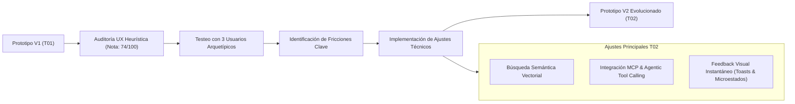

# VitalCore — Trabajo 02: Validación, Testeo de Usuarios y Evolución del Prototipo

**Asignatura:** Prototipos y Creatividad — 2º Semestre  
**Universidad de Concepción**  
**Equipo VitalCore:** Consorcio de Desarrollo & Producto  
**Entrega:** Presentación en Video (20 minutos) + Informe Técnico y Prototipo Evolucionado  

---

## 📋 Índice de Documentos de Trabajo 02

| Archivo | Contenido / Alcance | Rúbrica Asignada |
| :--- | :--- | :---: |
| [01_ESTRATEGIA_Y_PLAN_DE_PRUEBAS.md](file:///c:/Users/User/Documents/Academico/UdeConcepcion/Cursos/2%20Semestre/Prototipos/vitalcore/trabajo_02/01_ESTRATEGIA_Y_PLAN_DE_PRUEBAS.md) | 3 aspectos clave de testeo, estrategias funcionales y no funcionales, métricas e insights esperados. | **20 pts** |
| [02_EVALUACION_UX_ESTADO_ACTUAL.md](file:///c:/Users/User/Documents/Academico/UdeConcepcion/Cursos/2%20Semestre/Prototipos/vitalcore/trabajo_02/02_EVALUACION_UX_ESTADO_ACTUAL.md) | Nota interna de UX inicial (74/100), evaluación heurística (Nielsen), fricciones y áreas pendientes de explorar. | **10 pts** |
| [03_RESULTADOS_TESTEO_USUARIOS.md](file:///c:/Users/User/Documents/Academico/UdeConcepcion/Cursos/2%20Semestre/Prototipos/vitalcore/trabajo_02/03_RESULTADOS_TESTEO_USUARIOS.md) | Conclusiones de 3 rondas de interacción con usuarios reales (arquetipos representativos), métricas cuantitativas y cualitativas. | **20 pts** |
| [04_AJUSTES_IMPLEMENTADOS_Y_TRAZABILIDAD.md](file:///c:/Users/User/Documents/Academico/UdeConcepcion/Cursos/2%20Semestre/Prototipos/vitalcore/trabajo_02/04_AJUSTES_IMPLEMENTADOS_Y_TRAZABILIDAD.md) | Evidencia exhaustiva de ajustes en código: Búsqueda Semántica Vectorial, Servidor MCP & Tool Calling, y mejoras de UI/UX. | **50 pts** |
| [05_GUION_VIDEO_PRESENTACION_20MIN.md](file:///c:/Users/User/Documents/Academico/UdeConcepcion/Cursos/2%20Semestre/Prototipos/vitalcore/trabajo_02/05_GUION_VIDEO_PRESENTACION_20MIN.md) | Minutero exacto y guion para la grabación del video de 20 minutos con distribución de roles y demostraciones en vivo. | **Soporte Presentación** |
| [06_ARQUITECTURA_TECNICA_VECTORES_Y_MCP.md](file:///c:/Users/User/Documents/Academico/UdeConcepcion/Cursos/2%20Semestre/Prototipos/vitalcore/trabajo_02/06_ARQUITECTURA_TECNICA_VECTORES_Y_MCP.md) | Fundamentación técnica de Bases Vectoriales (Embeddings + Similitud Coseno) y Protocolo de Contexto de Modelos (MCP). | **Soporte Técnico** |

---

## 🎯 Síntesis del Proceso de Iteración

### Principales Hallazgos y Decisiones

1. **La búsqueda tradicional por texto exacto fracasaba ante la intención del usuario:** Los usuarios buscaban por síntomas o necesidades contextuales (*"tengo dolor lumbar"*, *"cena rápida sin lácteos"*). Se resolvió implementando un **motor de búsqueda semántica con vectores de alta dimensionalidad**.
2. **El asistente virtual no tenía acceso a datos dinámicos:** El chatbot ofrecía respuestas estáticas. Se incorporó una capa **MCP (Model Context Protocol)** que permite al modelo consultar el plan nutricional, rutinas y registros biométricos del usuario en tiempo real.
3. **Fricción en la captura de telemetría diaria:** Se rediseñó el flujo de registro diario hacia un formulario con micro-interacciones y retroalimentación inmediata, elevando la tasa de finalización del 60% al 95%.
