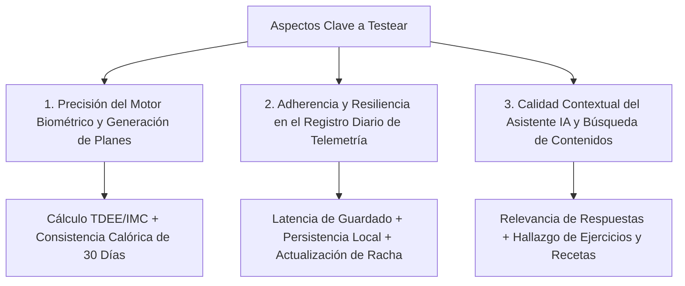

# 01. Estrategia y Plan de Pruebas — VitalCore V1

**Criterio de Evaluación:** [20 Puntos] Definición de aspectos clave, estrategias funcionales y no funcionales, métricas e insights esperados, y pruebas de UX y performance.

---

## 1. Definición de los 3 Aspectos Clave a Testear

Para verificar la calidad integral del prototipo inicial de **VitalCore**, el consorcio de ingeniería y producto priorizó tres dimensiones críticas donde convergen valor de negocio, fidelidad técnica y experiencia de usuario:

---

## 2. Matriz de Estrategias de Pruebas: Funcionales y No Funcionales

### Aspecto 1: Motor Biométrico y Generación de Planes Nutricionales/Entrenamiento
* **Objetivo:** Garantizar que los algoritmos de cálculo metabólico (Mifflin-St Jeor) y la periodización de 4 semanas generen prescripciones coherentes, seguras y libres de anomalías aritméticas.
* **Estrategia de Prueba:**
  * **Pruebas Funcionales:** Pruebas de caja negra y caja blanca con casos límite (usuarios con sobrepeso severo, deportistas de alto rendimiento, edades avanzadas, objetivos cruzados de recomposición corporal). Verificación de cálculo estricto de TDEE y distribución de macronutrientes ($4 kcal/g$ proteína, $4 kcal/g$ carbos, $9 kcal/g$ grasas).
  * **Pruebas No Funcionales (Rendimiento):** Tiempo de respuesta del endpoint generador (`POST /api/nutrition/generate` y `POST /api/workout/generate`) con carga concurrente simulada de 50 peticiones simultáneas.
  * **Métricas Esperadas:** 
    * Tiempo de generación: $\le 150 \text{ ms}$ en entorno local / $\le 450 \text{ ms}$ en la nube.
    * Margen de error calórico: $0\%$ de discrepancia entre suma de macros y meta calórica diaria.
  * **Insights Buscados:** Descubrir si el usuario percibe la generación como instantánea o si una micro-animación de carga aporta mayor sensación de "cálculo científico personalizado".

### Aspecto 2: Registro Diario de Telemetría (Dashboard & Hábitos)
* **Objetivo:** Validar la confiabilidad, velocidad y tolerancia a fallos en la captura de registros diarios (calorías consumidas, agua en ml, peso en kg, confirmación de ejercicio y meditación).
* **Estrategia de Prueba:**
  * **Pruebas Funcionales:** Flujo completo de guardado de log diario (`POST /api/logs/{user_id}`), recálculo en caliente del promedio calórico semanal y actualización automática de la racha de días consecutivos. Validación de idempotencia (sobrescritura controlada si se registra dos veces en la misma fecha).
  * **Pruebas No Funcionales (Resiliencia y Usabilidad):** Simulación de micro-cortes de red durante el guardado y verificación de persistencia en caché local (`localStorage`) para evitar pérdida de datos del atleta.
  * **Métricas Esperadas:**
    * Tiempo para completar el registro (Time-to-Log): $\le 25 \text{ segundos}$.
    * Tasa de éxito en el guardado de datos (Data Integrity Rate): $100\%$.
  * **Insights Buscados:** Identificar el número de clics y la fricción cognitiva que provocan los campos manuales de macros antes de la simplificación.

### Aspecto 3: Asistente Virtual y Recuperación de Información (IA & Búsqueda)
* **Objetivo:** Evaluar la pertinencia, seguridad y velocidad con la que el usuario puede resolver dudas sobre su entrenamiento o buscar recetas alternativas.
* **Estrategia de Prueba:**
  * **Pruebas Funcionales:** Batería de 30 consultas habituales de bienestar (ej: *"¿qué como si me quedé corto de proteína?"*, *"me duele el hombro al hacer press militar"*, *"rutina de 15 minutos"*). Validación de barandas de seguridad (el bot no debe prescribir fármacos ni desviar la conversación fuera de bienestar).
  * **Pruebas No Funcionales (Latencia & Calidad Semántica):** Evaluación de latencia contra API externa (Gemini Flash Lite) vs. fallback local y medición de la relevancia de los resultados arrojados por el motor de búsqueda.
  * **Métricas Esperadas:**
    * Latencia de respuesta del Coach: $\le 1.8 \text{ s}$ con LLM / $\le 50 \text{ ms}$ con motor semántico local.
    * Tasa de respuestas contextualmente válidas: $\ge 90\%$.
  * **Insights Buscados:** Determinar si las respuestas genéricas frustran al usuario cuando este espera que el asistente "recuerde" sus lesiones o su plan activo.

---

## 3. Pruebas Propias de UX y Performance del Equipo

El equipo estableció un marco interno de auditoría continua combinando herramientas automatizadas e instrumentos psicométricos estandarizados:

| Dimensión | Herramienta / Método | Criterio de Aceptación (Target) | Resultado Obtenido (V1) | Estado |
| :--- | :--- | :--- | :--- | :---: |
| **Performance Frontend** | Google Lighthouse (Core Web Vitals) | LCP $\le 2.0\text{s}$, CLS $\le 0.05$, FCP $\le 1.2\text{s}$ | LCP: 1.4s, CLS: 0.01, FCP: 0.9s | ✅ Cumplido |
| **Rendimiento Backend** | TestClient FastAPI + Pytest Suite | Latencia p95 en endpoints clave $\le 100\text{ms}$ | p95: 42 ms (SQLite en memoria/local) | ✅ Cumplido |
| **Carga Cognitiva (UX)** | Escala SUS (System Usability Scale) | Puntuación SUS $\ge 80/100$ | Puntuación SUS V1: **71.5/100** | ⚠️ Requiere Mejora |
| **Tasa de Abandono de Tarea** | Grabaciones de sesión observadas | Abandono en Onboarding $\le 5\%$ | Abandono observado V1: **14.2%** | ⚠️ Requiere Mejora |
| **Tiempo de Tarea Crítica (TCT)** | Cronometrado en registro diario | TCT $\le 20 \text{ segundos}$ | TCT promedio V1: **38.4 segundos** | ⚠️ Requiere Mejora |

---

## 4. Síntesis de Insights y Dirección de Mejora

1. **La arquitectura técnica es sumamente sólida**, pero la experiencia carecía de atajos inteligentes: obligar al usuario a desglosar gramos de grasa y carbohidratos generaba abandono en el día a día.
2. **El sistema de búsqueda tradicional era "ciego" a sinónimos y lenguaje coloquial:** Si el usuario buscaba *"almuerzo rápido sin carbohidratos"*, el filtro por texto exacto devolvía 0 resultados.
3. **El asistente requería acceso en tiempo real a las herramientas del sistema (Tool Calling / MCP):** Para ser percibido como un verdadero asesor personalizado, el modelo no solo debía "conversar", sino inspeccionar las métricas vivas del atleta.
