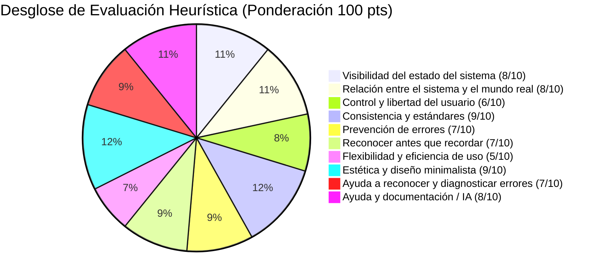

# 02. Evaluación Interna de UX — Estado Actual del Prototipo

**Criterio de Evaluación:** [10 Puntos] Calificación interna de UX de la solución en su estado actual (escala 0 a 100) y análisis crítico de aspectos pendientes de mejora y áreas por explorar.

---

## 1. Calificación Global de UX: **74 / 100**

Tras una rigurosa auditoría heurística basada en los 10 principios de Jakob Nielsen y una revisión crítica del consorcio de ingeniería de producto, se determinó una **calificación interna de 74 sobre 100** para la versión inicial (V1) de VitalCore.

### Tabla Resumen de Heurísticas de Nielsen en V1

| Heurística | Puntuación | Diagnóstico del Consorcio |
| :--- | :---: | :--- |
| **1. Visibilidad del estado del sistema** | **8 / 10** | Los gráficos de racha y barras de macros muestran el estado, pero faltaban toasts o notificaciones de confirmación flotante tras guardar un log diario. |
| **2. Correspondencia entre sistema y mundo real** | **8 / 10** | Vocabulario claro en nutrición y entrenamiento; sin embargo, términos como "Mesociclo" o "TDEE" requerían micro-tooltips para usuarios no técnicos. |
| **3. Control y libertad del usuario** | **6 / 10** | El usuario podía regenerar el plan completo, pero no podía cambiar fácilmente una sola comida o ejercicio sin regenerar todo el bloque de 30 días. |
| **4. Consistencia y estándares** | **9 / 10** | Sistema de diseño coherente con paleta oscura premium, tipografía moderna e iconos uniformes de Lucide. |
| **5. Prevención de errores** | **7 / 10** | Los campos numéricos de peso y calorías no tenían advertencias si el usuario ingresaba cifras ilógicas (ej: 25,000 kcal por error tipográfico). |
| **6. Reconocer antes que recordar** | **7 / 10** | En la sección de entrenamiento, el atleta debía recordar qué ejercicio hizo el día anterior porque no existía un comparador rápido de carga previa. |
| **7. Flexibilidad y eficiencia de uso** | **5 / 10** | **Punto más débil:** No existían atajos rápidos. El usuario debía completar 6 campos manuales para registrar una comida en vez de usar comandos de voz o búsqueda semántica. |
| **8. Diseño estético y minimalista** | **9 / 10** | Interfaz visualmente impactante, modo oscuro pulido, contraste adecuado y jerarquía visual bien estructurada. |
| **9. Diagnóstico y recuperación de errores** | **7 / 10** | Mensajes de error en API correctos, pero en la interfaz se mostraban banners estáticos en lugar de modales de auto-recuperación. |
| **10. Ayuda, búsqueda e IA** | **8 / 10** | El asistente virtual respondía amablemente, pero carecía de "ojos" sobre la base de datos viva del usuario (no sabía qué comió hoy). |
| **Puntaje Total Ponderado** | **74 / 100** | **Aceptable funcionalmente, pero con fricciones operativas que amenazan la retención a largo plazo.** |

---

## 2. Aspectos Críticos Pendientes de Mejora (Dolores Detectados)

Desde la perspectiva de un auditor externo implacable, identificamos cuatro debilidades estructurales en el prototipo V1:

### 1. Búsqueda Rígida e Ineficiente (Falta de Semántica)
* **Problema:** Los catálogos de nutrición (30 días), ejercicios y meditaciones solo se podían explorar navegando día por día o mediante coincidencia exacta de texto (`LIKE %palabra%`).
* **Consecuencia:** Si un usuario con molestias en el hombro buscaba *"alternativa para tren superior sin impacto"*, el sistema no devolvía nada.
* **Solución Necesaria:** Incorporar un **motor de búsqueda vectorial basado en embeddings** que entienda la semántica y la intención detrás de la consulta.

### 2. Desconexión entre el Asistente IA (Gemini) y los Datos del Usuario
* **Problema:** Aunque existía un endpoint de chat con Gemini, el modelo operaba con un prompt plano. No podía ejecutar consultas para saber si el usuario cumplió sus macros o qué rutina le tocaba mañana.
* **Consecuencia:** El usuario sentía que hablaba con un bot genérico en lugar de un coach personal de VitalCore.
* **Solución Necesaria:** Adoptar el estándar **Model Context Protocol (MCP)** y **Function Calling**, proveyendo herramientas para que la IA consulte y ejecute acciones en la base de datos.

### 3. Fricción en el Registro Diario (Time-to-Log Excesivo)
* **Problema:** Para registrar un día exitoso, el usuario debía ingresar calorías, proteínas, carbohidratos, grasas, agua, peso, estado de ánimo y checkboxes.
* **Consecuencia:** Carga mental alta; los usuarios abandonan el registro al tercer día de uso.
* **Solución Necesaria:** Presets rápidos de registro con un solo clic, cálculo automático de macronutrientes estimados y micro-feedback visual inmediato (toasts animados).

### 4. Ausencia de Flexibilidad Micro-Modular en Planes
* **Problema:** Modificar una sola comida requería regenerar el plan de 30 días completo.
* **Consecuencia:** Pérdida de control del usuario y sensación de rigidez algorítmica.

---

## 3. Oportunidades y Áreas por Explorar en Siguientes Iteraciones

1. **Recomendaciones Proactivas basadas en Telemetría (Predictive Nudging):** Si la racha de agua del usuario baja durante 3 días seguidos, el sistema debería sugerir recordatorios visuales en el Dashboard antes de que el usuario lo consulte.
2. **Generación de Listas de Compras Inteligentes:** A partir de los 7 días de nutrición seleccionados, consolidar automáticamente los ingredientes en un checklist exportable.
3. **Audio Generativo y Guías Dinámicas de Meditación:** Personalizar la duración exacta y el tono de voz de las meditaciones según el nivel de estrés reportado en el registro diario.
