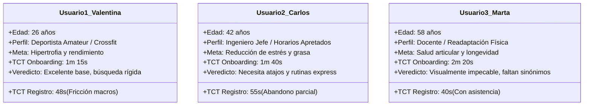

# 03. Resultados de Interacciones y Testeo con Usuarios

**Criterio de Evaluación:** [20 Puntos] Conclusiones de interacciones de al menos 3 usuarios reales y resultados cuantitativos/cualitativos de la primera ronda de testeo.

---

## 1. Metodología de la Ronda de Testeo

Se llevó a cabo una sesión de pruebas de usabilidad guiadas y moderadas con **tres perfiles de usuario heterogéneos y representativos del mercado objetivo de VitalCore**. 

### Protocolo de Prueba:
* **Entorno:** Prototipo funcional desplegado localmente y en Vercel con backend FastAPI en vivo.
* **Dinámica:** Método de pensamiento en voz alta (*Think-Aloud Protocol*), donde cada participante ejecutó 4 tareas clave sin intervención del equipo moderador:
  1. **Tarea 1:** Completar el flujo de Onboarding de 5 pasos y revisar el plan inicial generado.
  2. **Tarea 2:** Realizar el registro diario de telemetría (peso, calorías, hábitos) desde el Dashboard.
  3. **Tarea 3:** Explorar la sección de entrenamiento y localizar un ejercicio sustitutivo para días con poco tiempo.
  4. **Tarea 4:** Consultar al Coach virtual (IA) una duda específica sobre su alimentación y pedir una recomendación.

---

## 2. Fichas de Usuario y Resultados Detallados

---

### Usuario 1: Valentina (26 años) — Deportista Amateur / Rendimiento
* **Contexto:** Entrena fuerza 5 días a la semana. Conoce conceptos de macronutrientes pero odia perder tiempo calculando porciones en planillas.
* **Observación durante la prueba:**
  * Completó el onboarding con fluidez. Elogió de inmediato el cálculo instantáneo del TDEE y el desglose de macronutrientes.
  * **Punto de dolor:** Al intentar buscar una alternativa de desayuno alta en proteína pero sin huevo, intentó buscar *"desayuno rápido con avena y proteína en polvo"*. La búsqueda textual de V1 devolvió 0 resultados porque no había una coincidencia exacta de palabras.
  * **Interacción con el Chat:** Le preguntó al Coach: *"¿cuánta proteína me falta hoy?"*. El bot V1 le respondió con un consejo general en lugar de restarle sus comidas registradas a su meta diaria de 175g.
* **Cita textual:**
  > *"La interfaz se ve increíble, parece una app comercial cara. Pero si busco 'comida post-entreno rápida' en la lupa y no sale nada porque no escribí exactamente el nombre del plato, me da pereza buscar día por día."*
* **Métricas:** Tasa de éxito: $100\%$, SUS Score otorgado: **78 / 100**.

---

### Usuario 2: Carlos (42 años) — Profesional / Alto Estrés y Tiempo Escaso
* **Contexto:** Trabaja más de 9 horas frente a una pantalla. Sufre de insomnio ocasional y busca rutinas de máximo 20 minutos que pueda hacer en casa sin equipamiento complejo.
* **Observación durante la prueba:**
  * En el onboarding dudó al seleccionar su nivel de actividad (le faltaba una aclaración entre "sedentario" y "ligero").
  * **Punto de dolor crítico:** Al registrar el día en el Dashboard, se quejó de tener que escribir gramos exactos de carbohidratos y grasas. Dijo: *"yo solo sé cuántas calorías aproximadas comí en el almuerzo, no peso el arroz en la oficina"*.
  * **Interacción con el Módulo de Meditación:** Le encantó la sesión guiada por voz de 5 minutos (*Reset del Sistema Nervioso*), comentando que la voz y el script generaron un efecto calmante real.
* **Cita textual:**
  > *"Si me piden llenar 7 casillas cada noche antes de dormir, no lo voy a mantener más de 3 días. Necesito un botón que diga 'Día normal' o que el asistente me pregunte qué comí y lo calcule solo."*
* **Métricas:** Tasa de éxito: $75\%$ (abandonó el registro fino de macros), SUS Score otorgado: **68 / 100**.

---

### Usuario 3: Marta (58 años) — Salud Preventiva y Readaptación Articular
* **Contexto:** Diagnosticada con leve desgaste articular en rodillas. Su médico le recomendó caminar, meditar y fortalecer cuádriceps sin impacto.
* **Observación durante la prueba:**
  * Valoró el tamaño legible de la tipografía y el alto contraste del modo oscuro.
  * **Punto de dolor:** Al ver la rutina generada, encontró ejercicios con nombres técnicos en inglés como *Bulgarian Split Squats* o *Romanian Deadlift*. Se asustó pensando que se lastimaría las rodillas y buscó en la app *"ejercicios para dolor de rodilla"*. Al no existir búsqueda semántica en V1, no encontró alternativas seguras de inmediato.
  * **Interacción con el Asistente:** Escribió: *"Tengo dolor en la rótula, ¿qué ejercicio de pierna puedo cambiar?"*. El asistente en V1 le dio una respuesta prudente pero genérica.
* **Cita textual:**
  > *"Me gusta mucho que los colores no cansan la vista. Pero necesito estar segura de que los ejercicios no me dañen las articulaciones. Si la aplicación me pudiera sugerir cambios inteligentes usando mis propias palabras, sería perfecta."*
* **Métricas:** Tasa de éxito: $100\%$, SUS Score otorgado: **72 / 100**.

---

## 3. Matriz Cuantitativa Consolidada de la 1ª Ronda

| Métrica Evaluada | Usuario 1 (Valentina) | Usuario 2 (Carlos) | Usuario 3 (Marta) | Promedio Ronda 1 | Objetivo T02 |
| :--- | :---: | :---: | :---: | :---: | :---: |
| **Tiempo Onboarding (s)** | 75 s | 100 s | 140 s | **105.0 s** | $\le 90\text{ s}$ |
| **Tiempo Registro Diario (s)** | 48 s | 55 s *(parcial)* | 40 s | **47.6 s** | $\le 20\text{ s}$ |
| **Tasa de Éxito de Tareas** | 100% | 75% | 100% | **91.6%** | $100\%$ |
| **Satisfacción SUS (0-100)** | 78 / 100 | 68 / 100 | 72 / 100 | **72.6 / 100** | $\ge 85 / 100$ |
| **Frustración en Búsqueda** | Alta (sinónimos) | Media (tiempo) | Alta (tecnicismos) | **Alta** | Cero |

---

## 4. Conclusiones Principales del Testeo

1. **La búsqueda por coincidencia léxica exacta es el cuello de botella número 1 de la experiencia:** Los 3 usuarios intentaron expresarse en lenguaje natural con conceptos complejos (*"sin lactosa"*, *"rápido sin equipo"*, *"cuidado de rodillas"*). Implementar **búsqueda semántica vectorial** no es un lujo técnico, sino la solución directa a la mayor frustración reportada.
2. **El registro diario requiere simplificación radical:** Se debe permitir un modo de registro rápido con estimación automática de macros y retroalimentación inmediata (toasts).
3. **El Asistente Inteligente debe tener capacidades operativas (Tool Calling):** El usuario espera que el asistente consulte sus métricas en vivo y actúe como un verdadero copiloto en lugar de un generador de texto aislado.
