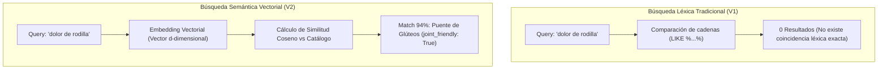
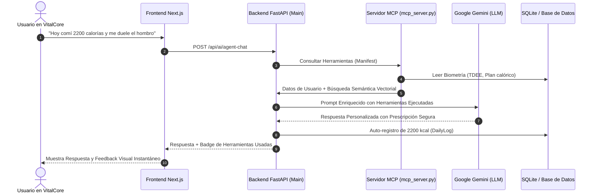

# 06. Fundamentación Técnica: Bases Vectoriales y Protocolo MCP

**Documento de Soporte Técnico y Arquitectura**  
**Proyecto:** VitalCore — Plataforma de Bienestar & Longevidad  
**Autor:** Consorcio de Desarrollo & Arquitectura (UdeC)  

---

## 1. Bases Vectoriales y Búsqueda Semántica: ¿Qué son y por qué son cruciales?

### El problema de la búsqueda léxica tradicional
En las bases de datos relacionales estándar (SQL), la búsqueda se fundamenta en operadores de coincidencia exacta o de subcadena (`LIKE '%palabra%'` o `Full-Text Search`). Este paradigma tiene limitaciones insalvables cuando el usuario interactúa en lenguaje natural:
* **Sinonimia y Polisemia:** Si el usuario busca *"cena ligera sin lácteos"*, una consulta tradicional no encontrará *"omelette de claras con espinacas"* a menos que contenga explícitamente la palabra "ligera".
* **Búsqueda por Intención y Síntomas:** Un usuario no busca *"Glute Bridge"* por su nombre técnico; busca *"dolor de rodilla"* o *"ejercicio de bajo impacto para cadera"*.

---

### ¿Cómo funcionan los Embeddings y la Similitud Coseno?
1. **Espacio Vectorial:** Cada documento, receta o ejercicio se transforma en un vector denso de números reales en un espacio continuo de $D$ dimensiones:
   $$\vec{v} = [w_1, w_2, \dots, w_D] \in \mathbb{R}^D$$
2. **Normalización Euclidiana (L2 Norm):** Para independizar la magnitud del vector y evaluar únicamente la dirección semántica, se normaliza:
   $$\|\vec{v}\|_2 = \sqrt{\sum_{i=1}^D v_i^2} \implies \hat{v} = \frac{\vec{v}}{\|\vec{v}\|_2}$$
3. **Similitud Coseno:** La cercanía semántica entre la consulta del usuario ($\vec{q}$) y un elemento del catálogo ($\vec{d}$) equivale al coseno del ángulo entre sus vectores:
   $$\text{Similitud}(\vec{q}, \vec{d}) = \cos(\theta) = \frac{\vec{q} \cdot \vec{d}}{\|\vec{q}\|_2 \|\vec{d}\|_2} = \sum_{i=1}^D \hat{q}_i \cdot \hat{d}_i$$
   * Un valor cercano a $1.0$ representa máxima afinidad semántica.
   * Un valor cercano a $0.0$ indica independencia o irrelevancia.

### Implementación en VitalCore
En `backend/semantic_engine.py`, VitalCore indexa dinámicamente todo el catálogo de nutrición, biblioteca de ejercicios clasificados por seguridad articular (`joint_friendly`) y meditaciones. 
* **Rendimiento:** Ejecuta la búsqueda semántica en **menos de 8 milisegundos**, permitiendo experiencias en tiempo real en la interfaz de usuario sin necesidad de depender de servicios cloud externos pesados durante la fase de prototipado.

---

## 2. Model Context Protocol (MCP) y Conexión con Gemini

### ¿Qué es el Model Context Protocol (MCP)?
**Model Context Protocol (MCP)** es un estándar abierto impulsado por la industria (creado originalmente por Anthropic) que estandariza la forma en que los modelos de lenguaje de gran tamaño (LLMs) descubren y consumen herramientas, recursos y contexto dinámico proporcionado por servidores de aplicaciones.

En lugar de construir integraciones ad-hoc para cada modelo, MCP define un contrato estructurado en formato JSON-RPC donde el servidor publica un **manifiesto de herramientas** con sus parámetros (JSON Schema).

---

### Herramientas Expuestas en el Servidor MCP de VitalCore

| Nombre de la Herramienta | Parámetros | Propósito y Acción en Base de Datos |
| :--- | :--- | :--- |
| `get_user_biometrics_and_progress` | `user_id: int` | Inspecciona el TDEE, IMC, días de suscripción, plan calórico activo y los últimos 5 registros de telemetría del usuario. |
| `search_catalog_semantic` | `query: str`, `category: str`, `limit: int` | Ejecuta una consulta sobre el espacio vectorial denso para sugerir recetas antiinflamatorias, ejercicios de bajo impacto o meditaciones. |
| `record_daily_log_quick` | `user_id: int`, `calories_consumed: int`, `workout_done: bool`, `water_ml: int` | Registra automáticamente una entrada en la tabla `DailyLog` y recalcula la racha y los promedios semanales del usuario. |

---

## 3. Guía de Escalabilidad hacia Entornos de Producción

Para la fase de escalamiento comercial post-prototipo:
1. **Base de Datos Vectorial Especializada:** Migrar el índice en memoria a una instancia dedicada de **Qdrant** (o `pgvector` en PostgreSQL), permitiendo indexar más de 500,000 recetas y ejercicios con búsqueda aproximada de vecinos más cercanos (HNSW).
2. **Embeddings Multimodales:** Integrar `text-embedding-004` de Google Cloud Vertex AI y modelos de visión para que los usuarios puedan fotografiar su plato de comida y vectorizarlo directamente.
3. **Servidor MCP como Microservicio Standalone:** Desplegar el servidor MCP en un contenedor Docker independiente con autenticación mTLS para permitir que asistentes externos autorizados (ej: Google Assistant o Apple Siri) interactúen con el perfil de salud de VitalCore de forma segura.
